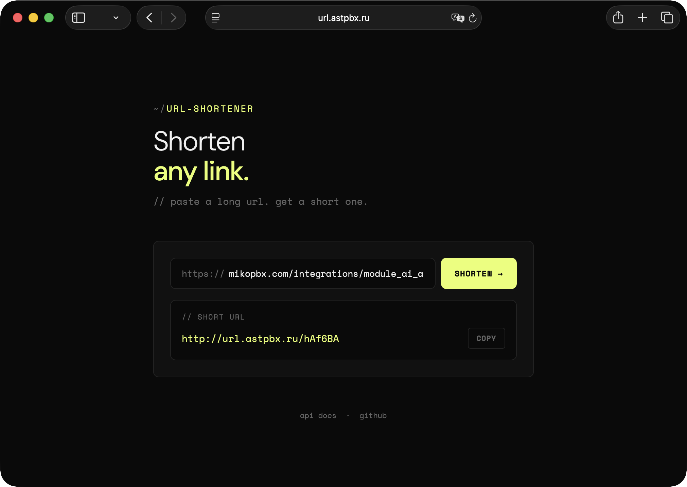
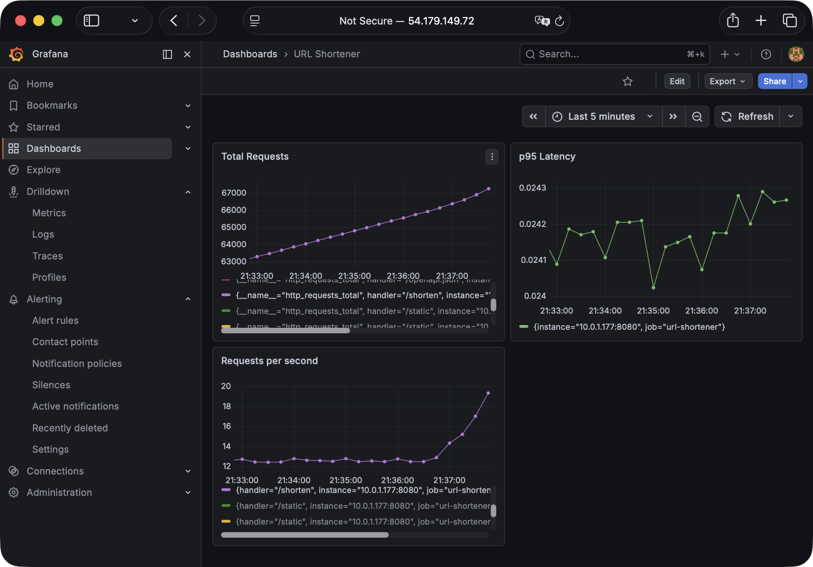
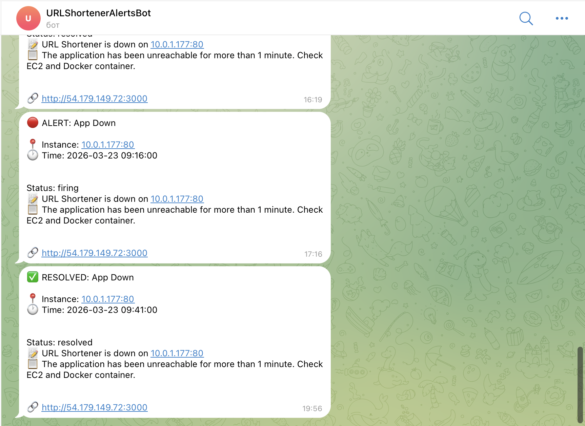

# 🔗 URL Shortener

A production-grade URL shortening service built with a full DevSecOps pipeline.




## 🌐 Live Service

**https://url.astpbx.ru** — Live UI

**https://url.astpbx.ru/docs** — Swagger API

## 🏗️ Architecture
```
Internet → Nginx (SSL) → Docker app (FastAPI) → RDS PostgreSQL (private subnet)
                              ↓
                      Prometheus → Grafana → Telegram alerts
```

## 🛠️ Tech Stack

| Tool | Purpose |
|------|---------|
| FastAPI | REST API + UI |
| PostgreSQL | Database (AWS RDS) |
| Redis | Cache |
| Docker | Containerization |
| Nginx | Reverse proxy + SSL termination |
| GitHub Actions | CI/CD pipeline |
| Terraform | Infrastructure as Code |
| AWS EC2 + RDS | Cloud hosting |
| Trivy | Container vulnerability scanning |
| Semgrep | Static code analysis (SAST) |
| Gitleaks | Secrets detection |
| Prometheus + Grafana | Metrics and dashboards |
| Let's Encrypt | SSL certificate |

## 🚀 Quick Start (local)
```bash
git clone https://github.com/excla1mmm/url-shortener
cd url-shortener
docker-compose up
# Open http://localhost:8000
```

## 🔄 CI/CD Pipeline

Every push triggers:
- Unit tests with PostgreSQL
- Gitleaks secrets scan
- Semgrep SAST (Python + Terraform rules)
- Docker build + Trivy CVE scan (fails on CRITICAL/HIGH)

Every merge to main triggers:
- Docker image push to GHCR
- Automatic deploy to EC2 via SSH
- Health check after deploy

## 🔒 Security

See [SECURITY.md](SECURITY.md) for full threat model.

Key measures:
- RDS in private subnet — no direct internet access
- IMDSv2 required on EC2 — prevents SSRF attacks
- SSH key-based auth only
- All secrets in GitHub Secrets, never in code
- Trivy blocks deploy on CRITICAL/HIGH CVE
- Semgrep scans every push
- Gitleaks prevents secret commits
- HTTPS with auto-renewing Let's Encrypt certificate

## 📊 Monitoring

- Prometheus scrapes metrics every 15 seconds
- Grafana dashboards: requests/sec, p95 latency, total requests, EC2 system metrics


- Telegram alert when app is down




## 📁 Project Structure
```
├── app/
│   ├── main.py           # FastAPI endpoints
│   ├── models.py         # SQLAlchemy models
│   ├── database.py       # PostgreSQL connection
│   ├── schemas.py        # Pydantic schemas
│   ├── templates/        # HTML UI
│   ├── static/           # CSS and JS
│   └── tests/            # pytest tests
├── terraform/            # AWS infrastructure (VPC, EC2, RDS, Security Groups)
├── nginx/                # Nginx reverse proxy config
├── monitoring/           # Prometheus config
├── .github/workflows/    # CI/CD pipelines
├── docker-compose.yml    # Local development
└── docker-compose.monitoring.yml  # Prometheus + Grafana + Node Exporter
```